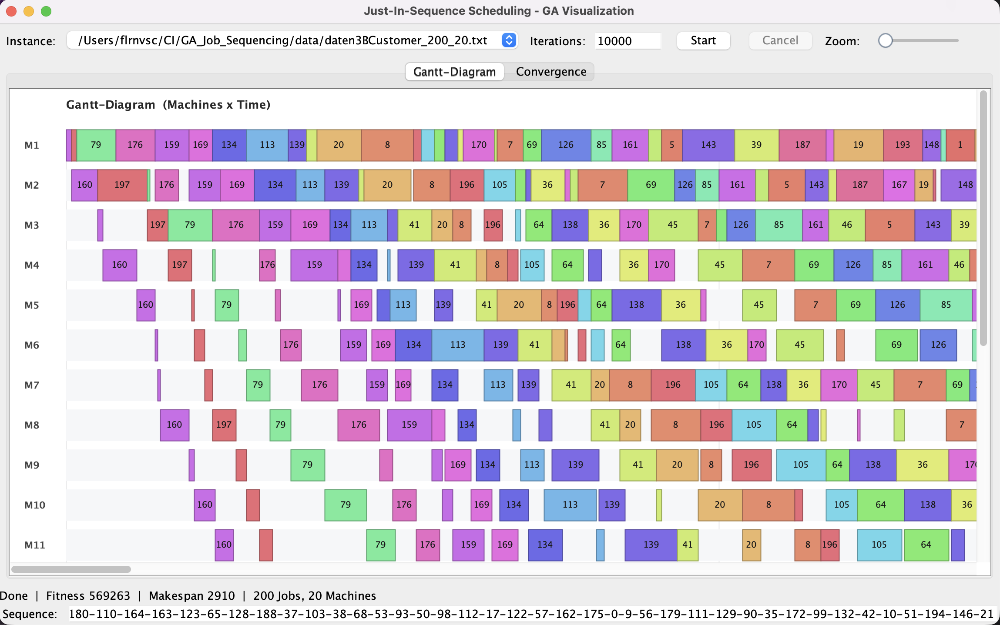
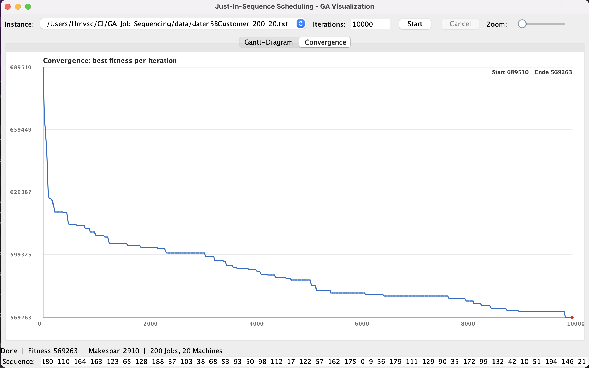
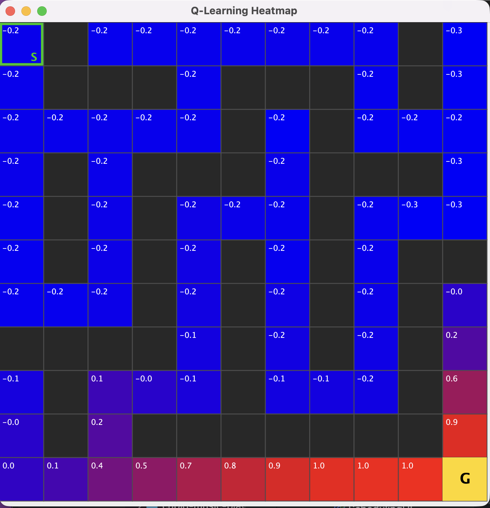
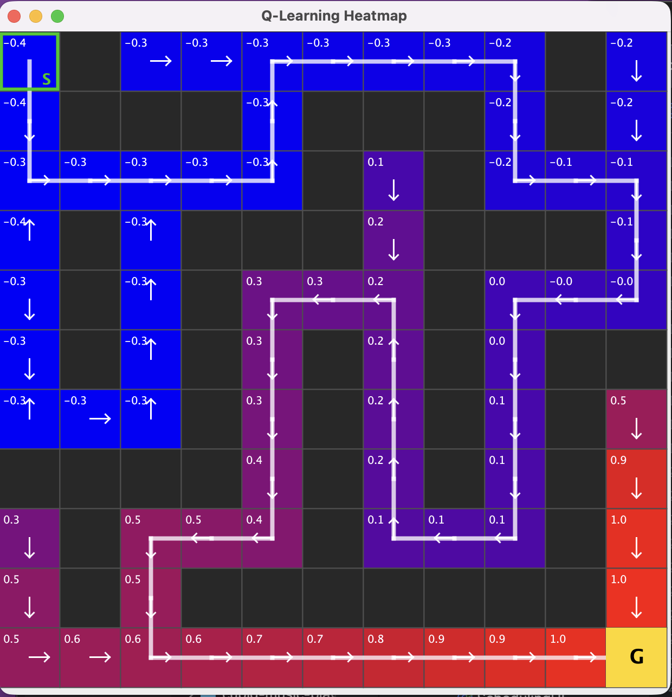
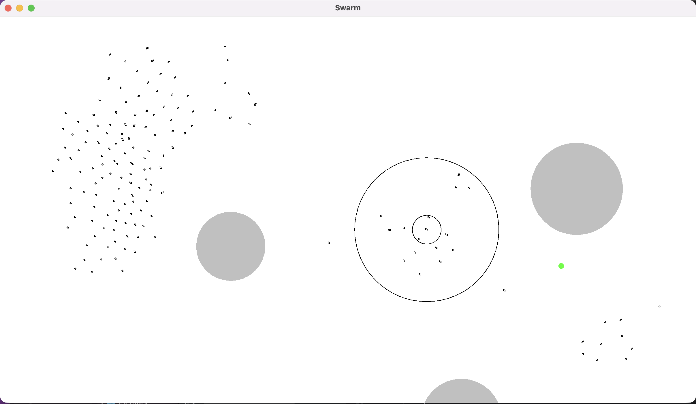

# Computational Intelligence

Three small, self contained Java projects that explore nature inspired optimisation and learning:
a **Genetic Algorithm** for production scheduling, a **Reinforcement Learning** agent that grows
from a Q-table into a Deep Q-Network, and a **Swarm Intelligence** boid model with goal seeking
and obstacle avoidance.

Each project ships with its own Swing visualisation, so you can watch the method work in real time.

> Coursework, Option 2. Authors: Dennis Bantel, Florian Vasica.

---

## Contents

1. [Genetic Algorithm: Just-In-Sequence scheduling](#1-genetic-algorithm-just-in-sequence-scheduling)
2. [Reinforcement Learning: tabular Q-Learning to DQN](#2-reinforcement-learning-tabular-q-learning-to-dqn)
3. [Swarm Intelligence: foraging boids](#3-swarm-intelligence-foraging-boids)
4. [Repository structure](#repository-structure)
5. [Build and run](#build-and-run)

---

## 1. Genetic Algorithm: Just-In-Sequence scheduling

An evolutionary search for the best job order in a permutation flow shop, where every job passes
through all machines in the same sequence. A solution is a permutation of the job indices, and the
fitness combines the total processing time with weighted delays taken from a precomputed delay
matrix. Earlier positions in the sequence are weighted more heavily, so the order of neighbouring
jobs drives the cost. Lower fitness is better.

**Key ideas**

* Permutation encoding, with a population of 100 initialised by Fisher-Yates shuffles.
* Binary tournament selection for a minimisation problem.
* Order Crossover (OX), which keeps every child a valid permutation.
* Swap mutation with an **adaptive rate**: when the search stalls the per position rate doubles
  (capped at 0.3) and resets to 1 / n after any improvement.
* **Elitism**: the best individual of each generation is carried into the next, so the best fitness
  can never get worse.

**Visualisation** (`SchedulingUI`): a live Gantt diagram of the best schedule and a convergence
curve of the best fitness per generation. A console runner is also available in `GA.main`.




The data files in `GA_Job_Sequencing/data/` use a simple format: line 1 is the number of jobs,
line 2 is the number of machines, then one line per job with its processing time on each machine.

---

## 2. Reinforcement Learning: tabular Q-Learning to DQN

An agent learns to cross an 11 by 11 maze from the top left start to the bottom right goal using
four moves (up, down, left, right). The maze is generated by recursive backtracking, then a few
walls are removed so two to four distinct routes exist. The agent only observes its current cell
as a one-hot vector and learns purely from reward feedback: +1.0 for reaching the goal, -0.02 per
step and -0.05 for bumping into a wall.

The project starts from the idea of a plain Q-table and then replaces it with a Deep Q-Network to
fix the table's weaknesses:

| Weakness of the table | Fix in the DQN |
| --- | --- |
| Exact storage scales badly | Function approximation (one-hot 121 to 128 ReLU hidden to 4 Q-values) |
| Correlated successive samples | Experience replay from a ring buffer, random minibatches |
| Bootstrapping on a moving target | A separate target network, synced every 500 steps |
| Fixed exploration | Epsilon decays from 1.0 to 0.05 |
| Only the last policy is kept | Elitism plus early stopping (patience) keeps the best network |

The temporal difference target is the reward plus the discounted best next value from the target
network, with the error clipped for stability.

**Visualisation** (`HeatmapVisualizer`): each cell is coloured by its best Q-value (blue low, red
high), white arrows show the greedy policy and a bold white line traces the greedy path from S to G.




---

## 3. Swarm Intelligence: foraging boids

A classic Reynolds boid flock built from three weighted steering rules, then extended with a goal
and obstacles. Each vehicle reacts only to its local neighbours.

**Base rules**

* **Cohesion** (weight 0.05): steer toward the average position of nearby vehicles.
* **Separation** (weight 0.55): push away from very close neighbours to avoid collisions.
* **Alignment** (weight 0.40): match the average heading of neighbours.

Separation acts inside radius 5, while cohesion and alignment use radius 25. Speed and acceleration
are capped, and the leader vehicle draws its two perception circles.

**Extensions**

* **Foraging** (weight 0.30): each vehicle computes a vector toward a food point and steers to it.
  When the food is eaten it respawns at a random free spot.
* **Obstacle avoidance** (weight 100): inside a safety margin the vehicle builds a vector away from
  the obstacle centre, scaled by how deep it sits in the danger zone. While avoiding, the
  acceleration cap is lifted so the dodge can be sharp.

**Visualisation** (`Simulation`): 160 vehicles forage toward the green food point while steering
around three grey obstacles.



---

## Repository structure

```
.
├── CI_Swarm/                 Swarm intelligence (boids)
│   ├── Simulation.java       main, sets up the flock and the food loop
│   ├── Canvas.java           Swing rendering of vehicles, food and obstacles
│   ├── Vehicle.java          steering rules, foraging and obstacle avoidance
│   └── VectorCalculation.java  vector helpers (normalize, truncate, angles)
│
├── GA_Job_Sequencing/        Genetic algorithm for flow-shop scheduling
│   ├── SchedulingUI.java      main, Gantt and convergence visualisation
│   ├── GA.java                the evolutionary loop (also runnable from the console)
│   ├── Problem.java           instance loading, delay matrix, fitness, makespan
│   ├── Individual.java        encoding, OX crossover, swap mutation
│   ├── GanttRenderer.java     Gantt drawing
│   ├── ConvergenceRenderer.java  convergence curve drawing
│   └── data/                  problem instances
│
└── nn/                       Reinforcement learning (Q-Learning and DQN)
    ├── QLearningGrid_DQN.java  main, maze, training loop, replay and target net
    ├── NeuralNetwork.java      small MLP with ReLU hidden layer and SGD
    └── HeatmapVisualizer.java  Swing heatmap of Q-values, policy and path
```

The screenshots above (`swarm_example.png`, `qa_example_1.png`, `qa_example_2.png`,
`neural_network_example_early.png`, `neural_network_example_finished.png`) live in the repository
root.

---

## Build and run

All three projects are plain Java with Swing and need no external libraries. A standard JDK
(version 8 or newer) is enough.

**Swarm**

```bash
cd CI_Swarm
javac *.java
java Simulation
```

**Reinforcement learning**

```bash
cd nn
javac *.java
java QLearningGrid_DQN
```

**Genetic algorithm**

```bash
cd GA_Job_Sequencing
javac *.java
java SchedulingUI      # graphical version
# or
java GA                # console runner
```

Note on data paths: `SchedulingUI` looks for the instances under
`<home>/CI/GA_Job_Sequencing/data/`. If you clone the repository elsewhere, either place it at that
location or adjust the `DATA_DIR` constant near the top of `SchedulingUI.java`. The console runner
`GA.main` uses the relative path `data/...`, so run it from inside `GA_Job_Sequencing`.

Tuning parameters (population size, episodes, learning rate, swarm size, weights and so on) live as
constants at the top of `GA.java`, `QLearningGrid_DQN.java` and `Simulation.java` / `Vehicle.java`.

---

## Authors

Dennis Bantel and Florian Vasica.
